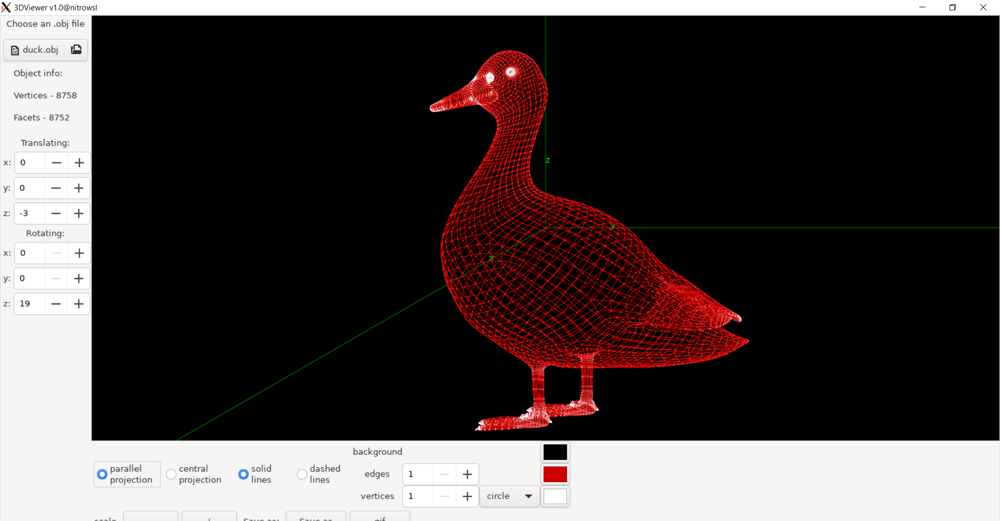
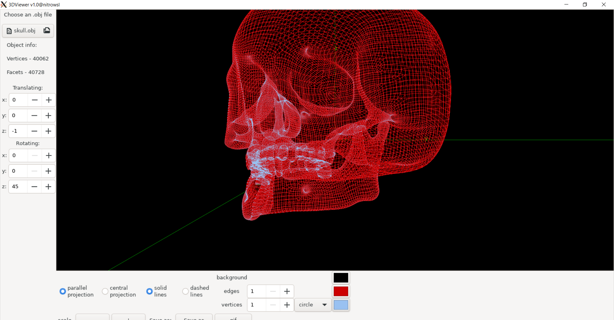

# 3DViewer v1.0

3DViewer is an application for viewing 3D wireframe models. The
models themselves must be loaded from .obj files and be viewable on the screen
with the ability to rotate, scale and translate.

To be sure an app builds run `make env` first.

For more information run `make dvi`, then open **readme.pdf**

 
 
